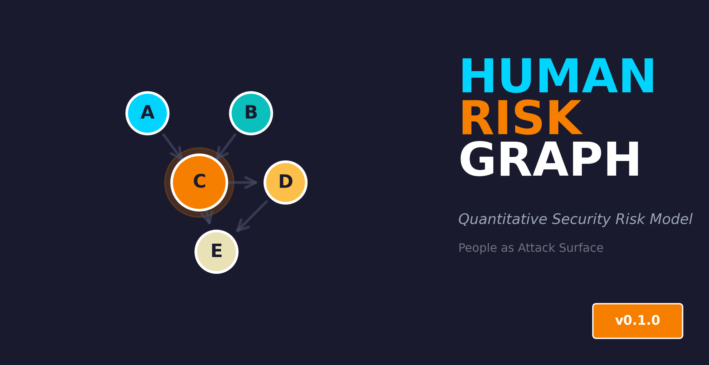

<p align="center">
  
</p>

<p align="center">
  <a href="https://github.com/LF3551/human-risk-graph/actions/workflows/ci.yml">
    
  </a>
  <a href="https://codecov.io/gh/LF3551/human-risk-graph">
    
  </a>
  <a href="https://github.com/LF3551/human-risk-graph/blob/main/LICENSE">
    
  </a>
  <a href="https://www.python.org/downloads/">
    
  </a>
  <a href="https://github.com/psf/black">
    
  </a>
</p>

# Human Risk Graph (HRG)

Human Risk Graph (HRG) is a quantitative model for measuring organizational
security risk caused by human dependencies, decision concentration,
and bus-factor effects.

Unlike traditional security models that focus only on technical assets,
HRG treats people as part of the attack surface and models how organizational
decisions and emergency processes introduce systemic risk.

## Core Idea

Organizations often depend on a small number of individuals for:
- critical decisions,
- emergency bypasses,
- access approvals.

HRG represents these dependencies as a directed graph and computes
risk metrics that highlight human single points of failure.

## What HRG Measures

- **Bus Factor Risk** — how fragile the organization is to the loss of key people
- **Decision Concentration** — how much authority is centralized
- **Bypass Risk** — how often normal controls are overridden by humans

## Repository Structure

- `src/` — core implementation (HRG class, metrics, graph algorithms)
- `tests/` — comprehensive unit tests
- `experiments/` — synthetic data generation and benchmarking
- `examples/` — usage demonstrations
- `paper/` — LaTeX source for academic paper (arXiv-ready)
- `docs/` — formal model with mathematical definitions
- `data/` — example organization datasets

## Quick Start

### Installation

```bash
# Install from source
git clone https://github.com/LF3551/human-risk-graph.git
cd human-risk-graph
pip install -e .

# Or install specific extras
pip install -e ".[dev]"  # Development tools
```

### CLI Usage

The easiest way to use HRG is through the command-line interface:

```bash
# Analyze an organization (generates JSON, Markdown, and HTML reports)
hrg analyze data/example_organization.json

# Generate only HTML report
hrg analyze data/example_organization.json --format html

# Specify output file
hrg analyze data/example_organization.json --format html --output my_report.html

# Generate interactive graph visualization only
hrg visualize data/example_organization.json
```

### Python API Usage

```python
from src.hrg import HumanRiskGraph

# Load your organization data
people = [...]
dependencies = [...]

# Create and analyze
hrg = HumanRiskGraph(people, dependencies)
results = hrg.calculate()

print(f"Composite Risk Score: {results['composite_score']:.3f}")
print(f"Critical People: {results['critical_people']}")
```

## Development

```bash
# Run tests
pytest tests/ -v

# Run tests with coverage
pytest tests/ --cov=src --cov-report=html
python experiments/run_experiments.py
```

## Key Features

- **Graph-based analysis** using NetworkX
- **Three core metrics**: Bus Factor, Decision Concentration, Bypass Risk
- **Polynomial-time algorithms** with proven complexity bounds
- **Comprehensive test coverage**
- **Research paper** ready for arXiv submission
- **CISSP portfolio** demonstration project

## Use Cases

- Security architecture analysis
- Business continuity planning
- Insider threat assessment
- Organizational risk modeling

## Status

This repository provides a **reference implementation** of the HRG model.
It is intended for research, architecture analysis, and discussion —
not as a production-ready security tool.

## License

Licensed under the Apache License, Version 2.0.
See the LICENSE file for details.
